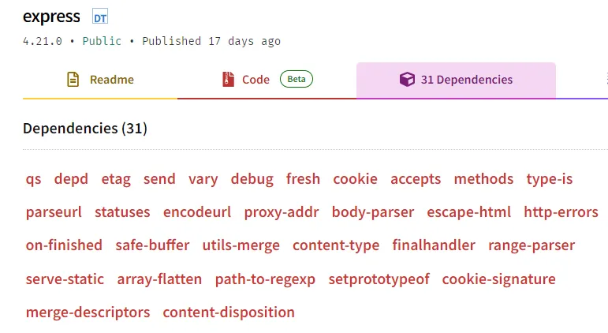

# 建立 Express 專案

步驟：

1. `npm init`

2. `npm install express`

3. 建立 app.js 檔

4. 啟動 server

5. 查看結果

<br>

## **1. `npm init` —** 初始化專案

```bash
$ npm init
```

npm 會問一系列問題以取得關於該專案的資訊；若是不想要每次都要回答全部問題，可以直接在 `npm init` 後面加上 `--yes` 或是 `-y` 一次同意。

初始化完後，就可以看到 npm 幫我們建立了一個 package.json 檔。

```bash
$ tree
.
└── package.json
```

在 package.json 檔中就紀錄了前面問題的回答或預設內容。而未來當有安裝使用其他的套件時，會再將所有套件的資訊紀錄於 dependencies 之中。

```bash
$ cat package.json
{
  "name": "backend",
  "version": "1.0.0",
  "description": "回答下述問題:",
  "main": "app.js",
  "scripts": {
    "test": "echo \"Error: no test specified\" && exit 1"
  },
  "author": "",
  "license": "ISC"
}
```

> [!NOTE]
>
> **scripts**
>
> 當所用的指令附加的參數越來越多，或是常常連續使用固定的幾個指令，這時 package.json 中提供能夠自定義的 scripts，可以將常使用的指令打包起來，格式為：`<script_name>: <commands>`。
>
> 未來要使用的時候就可以不用重新記憶、輸入一長串的指令，可以透過自定義能夠代表所執行動作意義的 script 名稱，以 `$ npm <script_name>` 的方式呼叫使用。
>
> 例如：要啟動 server 時原本會使用到 `$ node --env-file=.env app.js`，如果在 package.json 的 scripts 中加入 `“start”: “node --env-file=.env app.js”`，則當要啟動 server 時只須輸入 `$ npm start` 即可啟動 server 達成相同效果，而且 start 也更能代表所再執行的動作。

<br>

## **2. `npm install express`**

```bash
$ npm install express
```

-   安裝 package.json 檔中所有 dependencies
    ```bash
    $ npm install
    ```
-   安裝指定套件
    ```bash
    $ npm install <package-name>            # 最新版本
    $ npm install <package-name>@<version>  # 指定版本
    ```

> [!NOTE]
>
> **`npm install <package-name>` 可以附加的參數與對應的 dependencies**
>
> -   `--save-prod`、`-P`，預設：寫入 package.json 檔中的 dependencies
>
>     -   dependencies：執行該程式時會用到的套件
>
> -   `--save-dev`、`-D`：寫入 package.json 檔中的 devDependencies
>
>     -   devDependencies：只有在該程式的開發過程中會用到的套件，Ex. prettier
>
> -   `--save-peer`：寫入 package.json 檔中的 peerDependencies
>
>     -   peerDependencies：（在製作套件時才會使用，在一般的專案中不用）一套件於使用時需要搭配使用的其他套件，Ex. react 為 react-dom 的 peerDependencies
>
> -   `--save-optional`、`-O`：寫入 package.json 檔中的 optionalDependencies
>
>     -   optionalDependencies：執行該程式時會用到但即使沒有也不影響的套件
>
> -   `--no-save`：不寫入 package.json 檔

安裝完 express 套件後，再看 package.json 檔，會發現與剛初始化完的時候相比，現在多了 dependencies 這一項，其中還放入了剛剛安裝好的 express 版本紀錄。這就是 package.json 在專案中的一個重要角色 — 紀錄所有套件的資訊，未來只須要有這份紀錄，就可以直接用 `$ npm install` 來安裝所有使用該專案需要的套件。

```bash
$ cat package.json
{
  "name": "backend",
  "version": "1.0.0",
  "description": "回答下述問題:",
  "main": "app.js",
  "scripts": {
    "test": "echo \"Error: no test specified\" && exit 1"
  },
  "author": "",
  "license": "ISC",
  "dependencies": {
    "express": "^4.21.0"
  }
}
```

另外再看專案資料夾會發現現在多了 node_modules 資料夾以及 package-lock.json 檔。

```bash
$ tree
.
├── node_modules
│   ├── accepts
│   │   ├── HISTORY.md
│   │   ├── LICENSE
│   │   ├── README.md
│   │   ├── index.js
│   │   └── package.json
│   ├── （以下省略）
├── package-lock.json
└── package.json

```

node_modules 資料夾被放入了很多的資料夾，比對看看這些資料夾和 express 中的所有 dependencies，就會發現 express 的 dependencies 全部都有出現在 node_modules 之中（在表中標粗體斜字），若以 express 為第一層、express dependencies 為第二層，在 node_modules 中多出來的部分則是屬於第三層、第四層甚至是再往下推所需要的套件（例如：destroy 就屬於第二層套件 body-parser 和 send 的 dependencies）。在安裝一個套件的過程中，npm 會依照各套件 package.json 中所寫明的 dependencies 資訊再安裝其下的所有套件。

```bash
$ ls backend/node_modules/
```

|                           |                    |                          |                      |                      |
| ------------------------- | ------------------ | ------------------------ | -------------------- | -------------------- |
| **_accepts_**             | ee-first           | has-property-descriptors | mime-types           | **_send_**           |
| **_array-flatten_**       | **_encodeurl_**    | has-proto                | ms                   | **_serve-static_**   |
| **_body-parser_**         | es-define-property | has-symbols              | negotiator           | set-function-length  |
| bytes                     | es-errors          | hasown                   | object-inspect       | **_setprototypeof_** |
| call-bind                 | **_escape-html_**  | **_http-errors_**        | **_on-finished_**    | side-channel         |
| **_content-disposition_** | **_etag_**         | iconv-lite               | **_parseurl_**       | **_statuses_**       |
| **_content-type_**        | express            | inherits                 | **_path-to-regexp_** | toidentifier         |
| **_cookie_**              | **_finalhandler_** | ipaddr.js                | **_proxy-addr_**     | **_type-is_**        |
| **_cookie-signature_**    | forwarded          | media-typer              | **_qs_**             | unpipe               |
| **_debug_**               | **_fresh_**        | **_merge-descriptors_**  | **_range-parser_**   | **_utils-merge_**    |
| define-data-property      | function-bind      | **_methods_**            | raw-body             | **_vary_**           |
| **_depd_**                | get-intrinsic      | mime                     | **_safe-buffer_**    |                      |
| destroy                   | gopd               | mime-db                  | safer-buffer         |                      |



（來源：[express - npm](https://www.npmjs.com/package/express?activeTab=dependencies)）

<br>

## **3. 建立 app.js 檔**

```jsx
const express = require("express");
const app = express();
const port = 3000;

app.get("/", (req, res) => {
    res.send("Hello World!");
});

app.listen(port, () => {
    console.log(`Server is listening on port ${port}`);
});
```

利用 express 套件就可以建立起一個 server。

不過這樣的寫法是直接把該應用使用的 port 固定在 3000 了，這樣如果在不同的機器上使用時，可能因為該 port 已經有其他應用在使用，或是未分配到該 port 的資源等問題而不能使用。

因此如果想要解決這個問題，可以使用 `process.env.PORT` 來抓取環境變數（environment variables）。只需要在與 app.js 相同資料夾中建立 .env 檔並在其中標明 `PORT=<number>` ，並且在要啟動 server 時於 command 中改為輸入 `$ node --env-file=.env app.js`，即可靈活的在不同的環境使用不同的 port。

修改後的 app.js：

```bash
const express = require('express');
const app = express();
const port = process.env.PORT || 3000;

app.get('/', (req, res) => {
  res.send('Hello World!');
})

app.listen(port, () => {
  console.log(`Server is listening on port ${port}`);
})
```

另外 .env 檔除了 PORT 還可以放置其他的環境變數，像是密碼、API 密鑰（credentials）等不適合直接寫在 source code 中的機密資訊。

> [!NOTE]
>
> **JavaScript 引用模組的方式：CJS vs. ESM**
>
> |                  | **CJS (CommonJS)**                                                                               | **ESM (ESModule)**                                                               |
> | ---------------- | ------------------------------------------------------------------------------------------------ | -------------------------------------------------------------------------------- |
> | import           | `const <var_name> = require(<path>);`                                                            | `import <var_name> from <path>;`                                                 |
> | export           | default export：`module.exports = <var_name>;`、named export：`exports.<new_name> = <var_name>;` | default export：`export default <var_name>;`、named export：`export <var_name>;` |
> | 專用副檔名       | .cjs                                                                                             | .mjs                                                                             |
> | 若採用副檔名 .js | 預設解讀方式                                                                                     | 若欲採用此法，須於 package.json 中加入 `“type”: “module”`                        |

<br>

## **4. 啟動 server**

-   未使用 .env 檔

    ```bash
    $ node app.js
    ```

-   有使用 .env 檔

    ```bash
    $ node --env-file=.env app.js
    ```

<br>

## **5. 查看結果**

選擇以下其中一個方式，就可以連線到 server、查看 server 是否啟動成功。

1. 以瀏覽器開啟 http://localhost:<port>/

2. 指令 `$ curl http://localhost:<port>/`

> [!NOTE]
>
> **localhost**
>
> localhost 是一個被保留的網域名稱，用來代表目前的這台電腦，對應的 IP 位址通常為 127.0.0.1。

> [!NOTE]
>
> **curl 指令**
>
> curl 是一個 Linux command-line 中，透過多種傳輸協定，像是 HTTP、FTP 等， 進行下載、上傳、管理資料的工具。
>
> -   指令基本格式：
>
>     ```bash
>     $ curl <options> <URL>
>     ```
>
> -   常用指令：
>
>     1. 發出 HTTP request GET，並顯示 response 於終端機上
>
>         ```bash
>         $ curl <URL>
>         ```
>
>     2. 發出 HTTP request（包含：GET、POST、PUT、DELETE、PATCH）
>
>         ```bash
>         $ curl -X <request_method> <URL>
>         ```
>
>     3. 下載檔案
>
>         ```bash
>         $ curl -o <file_name> <URL>  // 自行命名
>         $ curl -O <URL>              // 依所下載檔案原始名稱命名
>         ```
>
>     4. 下載檔案過程中斷後繼續
>
>         ```bash
>         $ curl -C - -O <URL>
>         ```
>
>     5. 使用者存取權限驗證
>
>         ```bash
>         $ curl -u <username>:<password> <URL>
>         ```

<br>

當要將專案上傳至 GitHub repo 時，注意應該只上傳主要內容的部分。

不需要上傳的部分：

1. .env

    .env 檔案中所儲存的為目前電腦專屬的資訊，並非其他使用者、開發者所需要；另外其中還可能儲存一些具有機密性的資訊，像是密碼、API 金鑰等，更不應該上傳至 GitHub 而隨意流出。

2. node_modules/\*

    在 package.json 中已經有紀錄完整的 dependencies 資訊，所以當後續要再從 GitHub 中 clone 下來使用時，只須使用指令 `npm install` 即可取得所有執行中需要的套件，因此不需要將這些套件的內容上傳至 GitHub。

<br>

## 參考資料

**npm 指令**

-   [Node.js — An introduction to the npm package manager](https://nodejs.org/en/learn/getting-started/an-introduction-to-the-npm-package-manager)
-   [CLI Commands | npm Docs](https://docs.npmjs.com/cli/v10/commands)

**scripts**

-   [npm Tutorial for Beginners - 16 - npm Scripts](https://www.youtube.com/watch?v=hHt3oVk3XVk)

**dependencies**

-   [#18: dependencies in package.json - Mastering NPM - YouTube](https://www.youtube.com/watch?v=Sl5cK0if0xY)
-   [#19: devDependencies in package.json - Mastering NPM - YouTube](https://www.youtube.com/watch?v=_urfyYFfyjU)
-   [#20: peerDependencies in package.json - Mastering NPM - YouTube](https://www.youtube.com/watch?v=0l9YLCk0wOo)

**node_modules**

-   [express - npm](https://www.npmjs.com/package/express?activeTab=dependencies)

**.env**

-   [What is .env ? How to Set up and run a .env file in Node? | Codementor](https://www.codementor.io/@parthibakumarmurugesan/what-is-env-how-to-set-up-and-run-a-env-file-in-node-1pnyxw9yxj)
-   [Understanding process.env.PORT in Node.js | by Ankur | Medium](https://developerport.medium.com/understanding-process-env-port-in-node-js-e09aef80384c)

**CJS、ESM**

-   [什麼是 cjs, esm, amd, umd 我該如何選擇，js cjs 與 mjs 又有什麼差別 | by KAI - JIAN Zhan | Medium](https://medium.com/@derekjan1240/%E4%BB%80%E9%BA%BC%E6%98%AF-cjs-esm-amd-umd-%E6%88%91%E8%A9%B2%E5%A6%82%E4%BD%95%E9%81%B8%E6%93%87-js-cjs-%E8%88%87-mjs-%E5%8F%88%E6%9C%89%E4%BB%80%E9%BA%BC%E5%B7%AE%E5%88%A5-b2c3a929397c)

**localhost**

-   [第十七天：怎麼讓別人連到我作好的網站？ - iT 邦幫忙::一起幫忙解決難題，拯救 IT 人的一天](https://ithelp.ithome.com.tw/articles/10195920)

**curl**

-   [curl Command in Linux with Examples - GeeksforGeeks](https://www.geeksforgeeks.org/curl-command-in-linux-with-examples/)
