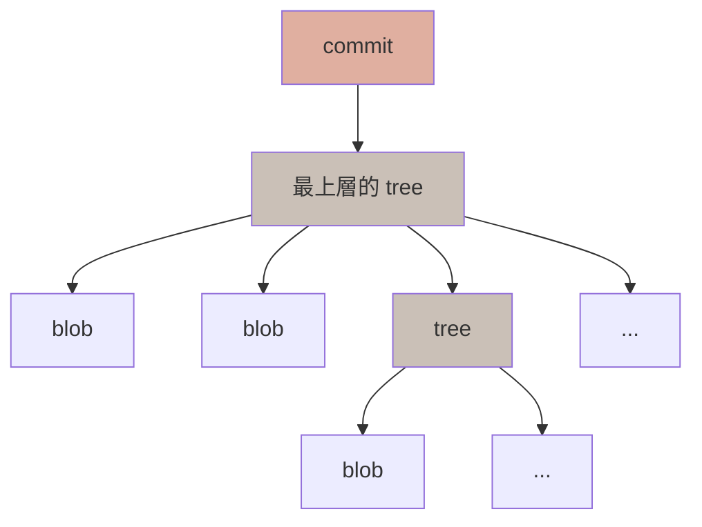
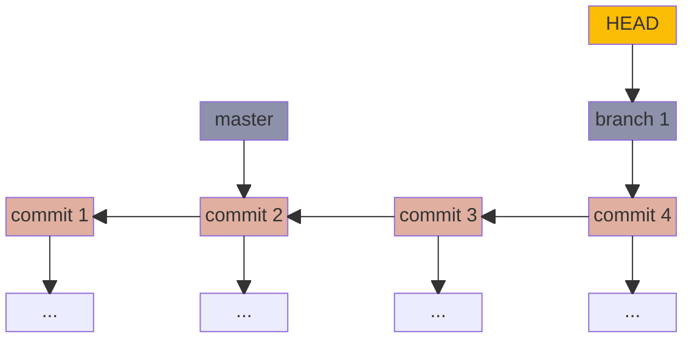

## Git 物件

Git 的主要儲存結構為 blob、tree、commit 3 種物件，分別記錄了檔案內容與資料夾、各次 commit 的快照，並透過相互連結的方式，建構出完整的版本紀錄。

### 物件類型
| 物件類型 | 紀錄對象 | 物件內容 | 物件產生時點 |
| --- | --- | --- | --- |
| **blob** | 檔案 | 檔案內容 | git add |
| **tree** | 資料夾 | 資料夾內容：檔案（對應 blob 物件）、資料夾（對應 tree 物件）<br/>• 檔案/資料夾 mode<br/>• 對應物件的類型<br/>• 對應物件的 hash 值<br/>• 檔案/資料夾名稱 | git commit |
| **commit** | commit | commit 內容：<br/>• 最上層的 tree 物件<br/>• 作者名稱、email 資訊<br/>• commit 時間<br/>• commit message<br/>• 前一筆 commit 物件的 hash 值 | git commit |

物件類型查詢方式：

```
$ git cat-file -t <hash_key> 
```

### 儲存邏輯
    
以物件內容經過 SHA-1 雜湊產生 hash 值後，於 .git/object 下，以 hash 值前 2 碼作為資料夾名稱，其餘值作為檔案名稱。

### 運作邏輯
    
透過 **commit 物件**中連結的最上層 tree 物件，找到該次 commit 所包含的目錄。

→ 透過 **tree 物件**中連結的 blob 物件與 tree 物件找到其下的各種檔案與資料夾

→ 透過 **blob 物件**可取得檔案的完整內容。

利用這樣一層一層向下連結的儲存結構，使得 Git 能達到儲存專案中各版本完整資訊的效果。


<br/>

## Git 分支

分支（branch）機制提供開發者切割出互不影響的開發環境；等到一分支的工作內容完成，再透過合併（merge）的方式，將各自的工作成果與其他分支的互相結合。

### 相關指令
| 功能 | 指令 |
| --- | --- |
| 建立 branch + 留在原 branch | `git branch <branch_name>` |
| 建立 branch + 切換至新 branch | `git checkout -b <branch_name>` |
| 切換至其他 branch | `git checkout <branch_name>` |
| 查詢已建立的 branch | `git branch` |
| 刪除 branch | `git branch -d <branch_name>` |
| 合併 branch | `git merge <branch_name>` |

### 儲存邏輯

| 類型 | 紀錄對象 | 內容 | 儲存位置 |
| --- | --- | --- | --- |
| **branch** | 某一個 branch | 該 branch 最後一筆 commit 物件的 hash 值 | .git/refs/heads/<branch_name> |
| **HEAD** | 目前所在 branch | 目前所在 branch 的路徑 | .git/HEAD | 

### 運作邏輯
透過 **branch 紀錄**找到最後一次 commit 物件，找到該次 commit 所包含的目錄。

→ 透過 **commit 物件**中連結的前一次 commit 物件，可以逐層往前追溯歷史；透過連結的最上層 **tree 物件**，找到該次 commit 所包含的目錄。



<br/>

## Commit Message

commit message 是關於一次 commit 中所有變動的摘要，是提供給他人與未來的自己了解該版本內容的重要指引。因此針對不同目的的變動應該分次 commit，才可以讓 commit message 更涵蓋、貼合變動的內容，以提供更完整的資訊。

### 格式

```
<type>(<scope>): <subject>
<BLANK LINE>
<body>
<BLANK LINE>
<footer>
```

- **標題 header**

    - **type**：commit 的變動類型

        | type | 變動類型 |
        | --- | --- |
        | feat | 新功能 |
        | fix | 修復 bug |
        | refactor | 調整程式碼本質的重構，但不屬於 feat、fix |
        | style | 不影響程式碼本質的格式調整 |
        | docs | 修改文件 |
        | perf | 改善效能 |
        | test | 增加測試 |
        | chore | 環境或使用的第三方套件變動 |
        | revert | 撤銷以前的 commit |

    - **scope**：commit 的變動影響範圍

    - **subject**：簡要說明。開頭使用大寫、結尾不標句點，使用祈使句表達，共 50 字以內。
   
- **內容 body**

    完整解釋該次 commit 改動了什麼（what）以及為什麼改動（why），每行 72 字以內。

- **頁尾 footer**

    標註本次 commit 的重大變動（BREAKING CHANGE）、GitHub issue 編號。

<br/>

## 參考資料
- [Learn-Git-in-30-days/zh-tw at master · doggy8088/Learn-Git-in-30-days](https://github.com/doggy8088/Learn-Git-in-30-days.git)
- [Git - Book](https://git-scm.com/book/zh-tw/v2)
- [Git Commit Message 這樣寫會更好&#65292;替專案引入規範與範例](https://wadehuanglearning.blogspot.com/2019/05/commit-commit-commit-why-what-commit.html)
- [Git Commit Guidelines | EU System](https://ec.europa.eu/component-library/v1.15.0/eu/docs/conventions/git/)