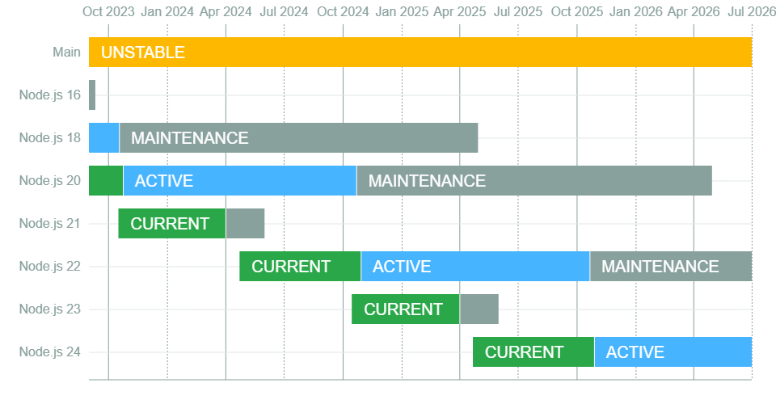

## Node.js

**功能：** 提供跨平台的 JavaScript 執行環境。

### Node.js 的版本維護邏輯



（來源：[nodejs/Release: Node.js Release Working Group](https://github.com/nodejs/Release#readme)）

<br/>

Node.js 的版本有固定的上線循環，每年 4 月會推出偶數版本、10 月推出奇數版本。每個版本在推出後分別會經歷以下 4 個階段：**Current → Active LTS → Maintenance → EOL (End-of-Life)**。

| 階段                                                      | 維護重點                                                                | 期間    |
| --------------------------------------------------------- | ----------------------------------------------------------------------- | ------- |
| **Current**                                               | 持續更新至最新狀態，鼓勵開發者與函式庫作者調整至使用最新版本            | 6 個月  |
| **Active LTS (Long Term Support)**<br/>\*奇數版本無此階段 | 在確保版本穩定、可靠的條件下進行部分更新                                | 12 個月 |
| **Maintenance**<br/>\*奇數版本無此階段                    | 只會針對重要的 bug 和安全性問題，以及有助移轉至後續版本的新功能進行更新 | 18 個月 |
| **EOL (End-of-Life)**                                     | 不再更新                                                                |         |

### 我安裝的 Node.js 版本：v20.17.0

基於選擇較新版本，與追求穩定性，希望未來可能使用的第三方套件盡量都能夠支援的考量，決定安裝目前處於 LTS 階段中的最新版本 Node.js 20 的 v20.17.0。

<br/>

## nvm (Node Version Manager)

**功能：** Node.js 的版本管理器，提供 Node.js 不同版本的安裝與切換使用。

當有多個專案同時在進行時，不同的專案可能各自使用不同版本的 Node.js，透過 nvm 就可以協助在不同專案間快速切換使用不同版本，而不需要卸載又重新安裝整個 Node.js，或是安裝多個版本後手動調整各種環境變數來切換。

### 安裝方式

```bash
$ curl -o- <https://raw.githubusercontent.com/nvm-sh/nvm/v0.40.1/install.sh> | bash
```

```bash
$ wget -qO- <https://raw.githubusercontent.com/nvm-sh/nvm/v0.40.1/install.sh> | bash
```

> **Note：**
>
> 版本依 [nvm-sh/nvm: Node Version Manager - POSIX-compliant bash script to manage multiple active node.js versions](https://github.com/nvm-sh/nvm?tab=readme-ov-file#installing-and-updating) 的更新而有異。

### 常用指令

-   安裝 Node.js
    ```bash
    $ nvm install node       # 最新版本
    $ nvm install <version>  # 指定版本
    ```
    > **Note：**
    >
    > node 為 Node.js 最新版本的別名。
-   切換版本
    ```bash
    $ nvm use <version>
    ```
-   查看所有可安裝的版本
    ```bash
    $ nvm ls-remote
    ```
-   查看已安裝的版本
    ```bash
    $ nvm ls
    ```
    > **Note：**
    >
    > 也可由 `nvm ls-remote` 中不同顏色的標示判斷。
-   查看目前使用的版本
    ```bash
    $ nvm current
    ```
    > **Note：**
    >
    > 也可由 `nvm ls-remote` 中不同顏色的標示判斷。

<br/>

## npm (Node Package Manager)

**功能：** Node.js 的標準套件管理工具，提供下載、管理、分享套件。

使用 npm 的優點：

1. npm 提供了一個將各種套件集中在一起的平台，讓我們在安裝或是更新套件時，不需要四處在各套件不同的來源找尋檔案來安裝。
2. npm 透過 package.json 的檔案形式記錄專案中需要的所有套件及其版本。當專案在移轉時，只需提供 package.json 檔案，npm 即可自行依據其中的 dependencies 相關欄位，重新下載安裝需要的所有套件，可以讓專案移轉更輕便。
3. npm 提供套件管理的功能，對於不同套件分別的相依套件，可以避免重複下載或是多個套件之間存在版本不相容的問題。

### 安裝方式

（在安裝 Node.js 時就會一併安裝好 npm）

### 常用指令

-   初始化專案

    -   有已寫好的 initializer
        ```bash
        $ npm init <initializer>
        ```
    -   沒有已寫好的 initializer
        ```bash
        $ npm init
        ```
        npm 會問一系列關於該專案的問題取得相關資訊後，建立 package.json 檔供後續記錄專案資訊與所有 dependencies。
        > **Note：**
        >
        > 可以附加的參數：
        >
        > `--yes`、`-y`：一次同意全部問題

-   安裝套件
    -   安裝 package.json 檔中所有 dependencies
        ```bash
        $ npm install
        ```
    -   安裝指定套件
        ```bash
        $ npm install <package-name>            # 最新版本
        $ npm install <package-name>@<version>  # 指定版本
        ```
        > **Note：**
        >
        > 可以附加的參數：
        >
        > -   `--save-prod`、`-P`，預設：寫入 package.json 檔中的 dependecies
        >
        >     -   dependencies：執行該程式時會用到的套件
        >
        > -   `--save-dev`、`-D`：寫入 package.json 檔中的 devDependecies
        >
        >     -   devDependencies：只有在該程式的開發過程中會用到的套件，Ex. prettier
        >
        > -   `--save-peer`：寫入 package.json 檔中的 peerDependecies
        >
        >     -   peerDependencies：（在製作套件時才會使用，在一般的專案中不用）一套件於使用時需要搭配使用的其他套件，Ex. react 為 react-dom 的 peerDependencies
        >
        > -   `--save-optional`、`-O`：寫入 package.json 檔中的 optionalDependecies
        >
        >     -   optionalDependencies：執行該程式時會用到但即使沒有也不影響的套件
        >
        > -   `--no-save`：不寫入 package.json 檔
-   查看所有已安裝套件
    ```bash
    $ npm ls
    ```
-   更新套件
    -   更新全部已安裝套件
        ```bash
        $ npm update
        ```
    -   更新指定套件
        ```bash
        $ npm update <package-name>
        ```
-   移除套件
    ```bash
    $ npm uninstall <package-name>
    ```

## 參考資料

**Node.js**

-   [nodejs/Release: Node.js Release Working Group](https://github.com/nodejs/Release#readme)

**nvm (Node Version Manager)**

-   [nvm-sh/nvm: Node Version Manager - POSIX-compliant bash script to manage multiple active node.js versions](https://github.com/nvm-sh/nvm)

**npm (Node Package Manager)**

-   [Node.js — An introduction to the npm package manager](https://nodejs.org/en/learn/getting-started/an-introduction-to-the-npm-package-manager)
-   [CLI Commands | npm Docs](https://docs.npmjs.com/cli/v10/commands)
-   [【前端工具】套件的管理者 - npm ｜方格子 vocus](https://vocus.cc/article/64491d9cfd897800018931c4)
-   [#18: dependencies in package.json - Mastering NPM - YouTube](https://www.youtube.com/watch?v=Sl5cK0if0xY)
-   [#19: devDependencies in package.json - Mastering NPM - YouTube](https://www.youtube.com/watch?v=_urfyYFfyjU)
-   [#20: peerDependencies in package.json - Mastering NPM - YouTube](https://www.youtube.com/watch?v=0l9YLCk0wOo)
