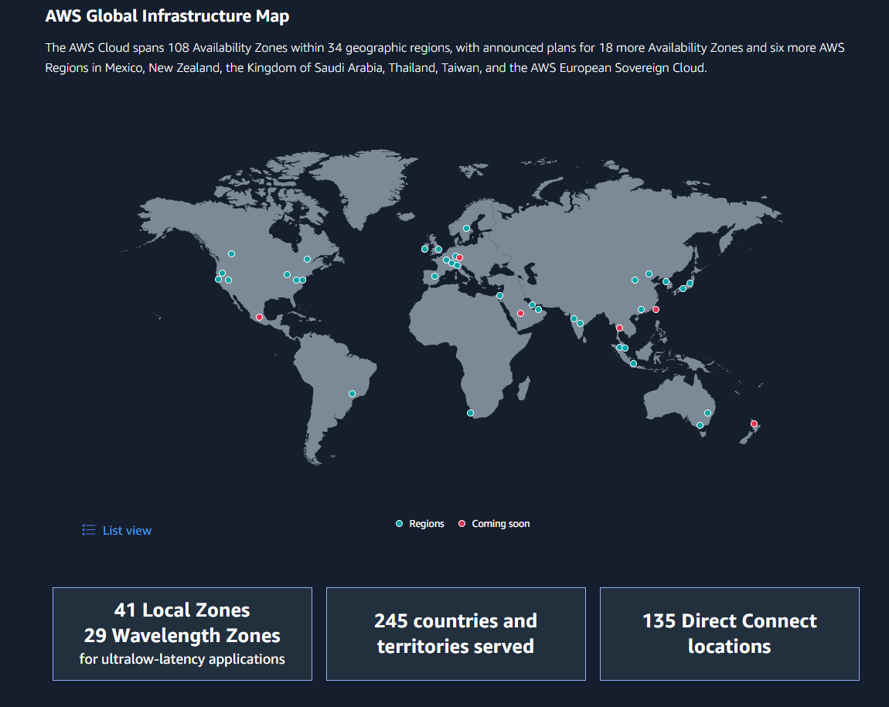
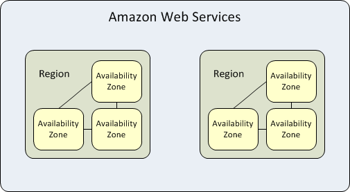
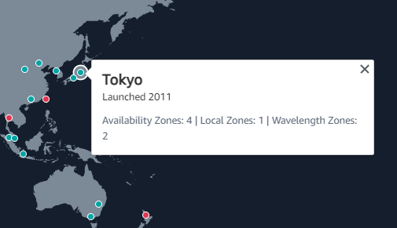
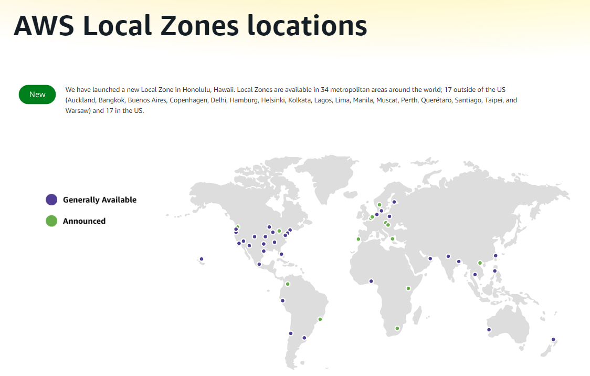
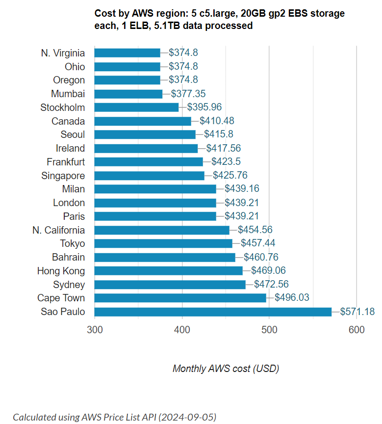

## AWS Global Infrastructure

當我們在使用 AWS 提供的雲端服務時，實際上是租用了 AWS 所提供的硬體資源，並透過網路進行存取。而為了滿足來自全球各地的使用者需求，AWS 在世界各地建立了許多的實體機房，以確保能擴大服務觸及範圍、反應快速、滿足使用者對於資料備份提高可用性的需求，而這些硬體設備就構成了 AWS 的全球基礎建設（AWS Global Infrastructure）。

（來源：[Global Infrastructure - AWS](https://aws.amazon.com/about-aws/global-infrastructure/) ）

**AWS Global Infrastructure 的基本組成單位：data center < AZ (availability zone) < region**

（來源：[AWS Availability Zones, Regions, &amp; Placement Groups Explained](https://bluexp.netapp.com/blog/aws-availability-zones-architecture-how-to-select)）

### AZ (availability zone)

**AZ** 是由獨立的一群 data center 構成。

當要建置實例（instance）時，須要選擇要使用哪個 AZ 裡的資源。此外，若對於網站、應用程式運作穩定度、可用性要求比較高的情況下，可以透過在同一個 region 同時使用多個 AZ 來達到備份效果，這樣當其中任何一個 AZ 出現狀況無法正常運作時，備援 AZ 就可以即時的補上繼續運作，這樣的模式被稱作 Multi-AZ。

### Region

**region** 由 2 個以上地理位置上相近的 AZ 構成，在同一個 region 內的 AZ 與 AZ 之間透過低延遲的網路相連接，以東京這個 region 而言其中就包含了 4 個 AZ。通常 region 與 region 之間是高度獨立的，不同的 region 內有其各自可支援的不同服務。

（來源：[Global Infrastructure - AWS](https://aws.amazon.com/about-aws/global-infrastructure/) ）

### 其他基礎設施組成單位

除了 region 和 AZ 是使用 AWS 服務中一定會使用到的基礎設施以外，AWS 還有另外供應類似於 AZ 但又針對特定需求設計的基礎設施。

-   Local Zone

    local zone 是 region 的延伸，強調更靠近使用者、提供更低延遲的服務，並且可滿足希望將資料保留在當地的需求，但能相對於 AZ 能提供的服務比較有限。

    

    （來源：[AWS Local Zones Locations - AWS](https://aws.amazon.com/about-aws/global-infrastructure/localzones/locations/?nc=sn&loc=3)）

-   Wavelength Zone

    wavelength zone 能夠透過 5G 網路傳輸提供行動裝置更低延遲的服務。

-   AWS Outpost

    將 AWS 的基礎設施、服務延伸、建置於用戶端，讓用戶可以使用受 AWS 管理的本地資源，搭配 AWS 的使用介面，而能滿足低延遲與資料保留在本地端需求。

### 如何選擇 region？

在面對 AWS Global Infrastructure 這麼多不同的選擇的時候，主要可以考量以下幾個不同 region 的差異處，來決定該如何選擇 region。

1. 傳輸速度、距離導致的延遲

    選擇鄰近主要使用者所在地的 region，可以降低傳輸延遲，提升使用者體驗。

    另外若很重視低延遲，也可搭配更靠近使用者的 local zone；以台灣為例，台灣 local zone 的 parent region 為東京，以 local zone 搭配所屬的 parent region 也能獲得較低延遲的傳輸。

2. 成本

    即使使用相同的服務、相同的用量，在不同的 region 也會有不同的收費標準，可以依據自己主要使用服務為基準進行評估。

    

    （來源：[Save yourself a lot of pain (and money) by choosing your AWS Region wisely - Concurrency Labs](https://www.concurrencylabs.com/blog/choose-your-aws-region-wisely/)）

3. 需要的服務項目

    因為 region 之間彼此是互相獨立、資源不共享的，所以在選擇 region 時也應該確定須要使用的服務是否在該 region 中有提供，以及能夠提供的品質為何。

4. region 中的 AZ 數量

    若是有做 Multi-AZ 的備份需求，須評估 AZ 的數量是否符合自己需要的備份量。

5. 監管環境要求、安全性

    評估是否有機密性、安全性的理由，而必須將資料放在特定區域、必須要配合安全隱私規範等的限制。

### 參考資料

-   [Global Infrastructure - AWS](https://aws.amazon.com/about-aws/global-infrastructure/)
-   [Regions and Zones - Amazon Elastic Compute Cloud](https://docs.aws.amazon.com/AWSEC2/latest/UserGuide/using-regions-availability-zones.html)
-   [AWS Local Zones Locations - AWS](https://aws.amazon.com/about-aws/global-infrastructure/localzones/locations/?nc=sn&loc=3)
-   [What is AWS Local Zones? - AWS Local Zones](https://docs.aws.amazon.com/local-zones/latest/ug/what-is-aws-local-zones.html)
-   [AWS Availability Zones, Regions, &amp; Placement Groups Explained](https://bluexp.netapp.com/blog/aws-availability-zones-architecture-how-to-select)
-   [AWS 證照 教學 零基礎入門篇 - AWS Region, AZ, Edge Locations 介紹｜ Cloud Practitioner 證照準備](https://www.youtube.com/watch?v=bi9q9JKizaU)
-   [Save yourself a lot of pain (and money) by choosing your AWS Region wisely - Concurrency Labs](https://www.concurrencylabs.com/blog/choose-your-aws-region-wisely/)
