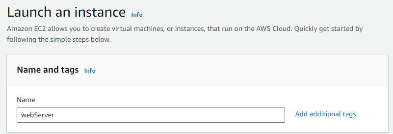

# 建立 EC2 主機與部署 Web Server

步驟：

1. [建立 EC2 instance](#1-建立-ec2-instance)

2. [透過 SSH 連線至 EC2 instance](#2-透過-ssh-連線至-ec2-instance)

3. [更新作業系統與套件](#3-更新作業系統與套件)

4. [安裝、啟動 Nginx](#4-安裝啟動-nginx)

5. [安裝 Node.js](#5-安裝-nodejs)

6. [建立 Express server](#6-建立-express-server)

7. [透過 npm 安裝 pm2 套件，啟動 Express server](#7-透過-npm-安裝-pm2-套件啟動-express-server)

8. [設定 Nginx，proxy 到 Express server](#8-設定-nginxproxy-到-express-server)

## 1. 建立 EC2 instance

（Public IPv4 address: [3.34.146.163](http://3.34.146.163/)）



- OS: Ubuntu 24.04

  

- instance type: t2.micro

  

  **instance type** 選擇的是可以使用的 **電腦硬體規格** 。不同的 instance type 在算力、記憶體、儲存容量、網路頻寬上會有不同的規格差異，以及收費標準，在選擇上應該依據自己要架設的應用主要的使用需求來判斷。

  AWS 針對不同的使用需求，有將 instance type 區分成了針對不同部份資源做最佳化的數種類別，包括：

  1. general purpose

  2. compute optimized — 使用高效能的處理器

  3. accelerate computing — 使用硬體加速器、co-processor；例如：GPU

  4. HPC optimized — 針對 HPC (High Performance Computing) 的工作

  5. memory optimized

  6. storage optimized

- security group: Inbound 22 & 80 port

  

  

  **security group** 的角色是 **虛擬防火牆** ，功能是在管制所有對 instance 的 inbound（例如：用戶端發送 request 給 instance）和 outbound（例如：instance 發送 response 給用戶端）流量。

  預設規則會拒絕全部的 inbound 流量（除了部分 Amazon 的服務例外，例如：Amazon DNS）、同意所有的 outbound 流量。因此為了要可以連線使用 instance 以及放在 instance 上的應用，就必須要更改預設值，增加 inbound rule，來允許部分可以對 instance 連線的方式和範圍。

  以目前的設定而言，我們設定了 2 個 inbound rule，分別是用 command-line 的 ssh 指令連線的 port 22，和用瀏覽器或 curl 指令的方式 HTTP 連線的 port 80，除了設定好的 2 種連線方式以外，其他方式都會被 security group 阻擋而無法連線至 instance。

  security group 作為一種保護機制，在設定上應該盡量遵守以下原則：

  1. 限制只能由特定使用者建立、修改。

  2. 在能滿足需求的情況下，只開放最少數量、最小範圍。

     像是限制連線的 IP 範圍時，相較於以 0.0.0.0/0（IPv4）或 ::/（IPv6）開放全部範圍的 IP，如果已知只會接受特定範圍的 IP 連線時，直接將範圍設定至該指定範圍會更好。

以上設定都設定完畢後，就可以點選 Launch instance 來建立 EC2 instance。等到初始化完成後，就可以在 instances 中看到新建立的 EC2 instance 已經開始運作了。


## 2. 透過 SSH 連線至 EC2 instance

```bash
$ ssh -i </path/key-pair-name>.pem <instance-user-name>@<instance-public-dns-name>
```

- 因為前面設定時建立的 OS 為 Ubuntu，使用的 instance-user-name 為 ubuntu。

- instance-public-dns-name 使用 instance 配置的 Public IPv4 address。

> [!NOTE]
>
> **遇到的問題**
>
> 連線時跳出以下錯誤訊息：
>
> 1.  ```
>     Unable to negotiate with x.x.x.x port 2222: no matching host key type found. Their offer: ssh-rsa
>     ```
>
>     出現這樣的錯誤是因為較新版本的 openssh 預設會禁用 ssh-rsa，如果在遇到對方 server 只支援 ssh-rsa 時，就會遇到無法連線的問題。
>
>     → 解決方式：（擇一）
>
>     1. 在輸入 ssh 指令時，增加開啟 ssh-rsa，因此要透過 ssh 連線至 EC2 instance 時輸入的指令應改為：
>
>        ```bash
>        $ ssh -o HostKeyAlgorithms=+ssh-rsa -o PubkeyAcceptedKeyTypes=+ssh-rsa  -i </path/key-pair-name>.pem <instance-user-name>@<instance-public-dns-name>
>        ```
>
>     2. 改動 ssh 的設定檔（~/.ssh/config），將 ssh-rsa 加入。
>
>        ```
>        HostKeyAlgorithms=+ssh-rsa
>        PubkeyAcceptedKeyTypes=+ssh-rsa
>        ```
>
> 2.  ```
>     Permissions 0777 for '/Users/username/.ssh/id_rsa' are too open.
>     It is recommended that your private key files are NOT accessible by others.
>     This private key will be ignored.
>     ```
>
>     出現這樣的錯誤是因為 private key 檔案的權限太過開放，可能造成安全問題，因而被限制不得使用。
>
>     → 解決方式：
>
>     從錯誤訊息中可知 private key 檔案應該是不能讓所有其他人有存取權限的，因此要使用以下指令來關閉其他人對該檔案的存取權限。
>
>     ```bash
>     $ chmod 600 ~/.ssh/id_rsa
>     # or
>     $ chmod 400 ~/.ssh/id_rsa
>     ```
>
>     在 chmod 指令中，權限是由 8 進制的 3 位數字來定義，由左至右分別代表 user、group、other 的存取權限；每一位數字又可以再以 2 進制拆解成 3 個數字，由左至右分別代表 r (read)、w (write)、x (execute)。
>
>     
>
>     （來源：[Linux chmod 命令 | 菜鸟教程](https://www.runoob.com/linux/linux-comm-chmod.html)）
>
>     因此上述指令中的 600，使用者本身的權限為 6 (110)，可以有讀寫的權限，其他使用者則皆為 0 (000)，完全無權限；而若是使用 400，使用者本身的權限則為 4 (100)，只有讀的權限，其他使用者同樣也是完全無權限。

## 3. 更新作業系統與套件

```bash
$ sudo apt update -y
$ sudo apt upgrade -y
```

> [!NOTE]
>
> **sudo 指令**
>
> 在 Linux 系統中，為了保障系統運作，可以對不同的使用者設定不同的指令使用權限，一般使用者通常不會擁有全部權限，以避免使用者在執行指令的過程中造成系統的破壞；而相對於一般使用者，系統中有一個最高權限的使用者稱為 root 使用者（superuser），root 使用者作為最高權限使用者，擁有不受限制的權限，可以使用所有的指令。像是安裝或移除軟體、管理系統設定、系統資源等的特權指令，會被限制為只能由 root 使用者執行。
>
> 如果一般使用者想要使用特權指令，就必須要切換至 root 使用者，或是取得 root 使用者的權限，才能夠執行指令。要達成上述目的，在 Linux 系統中有提供了以下 2 個方式：
>
> |                       | 取得的權限範圍                                                                             | 須提供的密碼         |
> | --------------------- | ------------------------------------------------------------------------------------------ | -------------------- |
> | `su` (switch user)    | 完整的 root 權限                                                                           | root 使用者的密碼    |
> | `sudo` (superuser do) | 指定範圍的權限（在 /etc/sudoers 中可以針對個別使用者設定他在使用 sudo 時能取得的權限範圍） | 一般使用者本身的密碼 |

## 4. 安裝、啟動 Nginx

```bash
$ sudo apt install nginx  # 安裝 Nginx

$ nginx                   # 啟動 Nginx
```

**Nginx** 是一種 **web server** 。在 client 發送 request 給 server 向 server 請求資料，而 server 將 response 回傳給 client 的過程中，總共會經過兩種 server，分別是主要負責處理靜態資源的 web server 和負責動態資源的 application server。所謂的靜態資源是指內容固定不動的，例如網站內容架構的 HTML 檔、CSS 檔、圖片，目前主要被使用的 web server 有 Nginx 和 Apache 兩種；而動態資源則會依據不同的輸入資料、狀態輸出不同的內容，例如因應不同使用者登入而呈現出的客製化內容，像是我們在專案中使用的 Node.js express 框架，就是搭建 application server 的一種方式。


（來源：[Unveiling Application Servers: Exploring Definition, Use Cases, Advantages, and Types | FS Community](https://community.fs.com/article/application-server-guide-a-detailed-perspective.html)）

web server 除了負責處理靜態資源之外，還扮演了反向代理（reverse proxy）的角色。

當使用者發出的 request 需要動態資源時，web server 會向 application server 再發出 request，等到 application server 處理完回傳 response 後，web server 會再將該 response 回傳給 client。對於 client 端而言，建立連結、傳輸的對象都會是中間的 web server，後面的 application server 則會被隱藏起來，這樣的過程中 web server 執行的工作就被稱做 reverse proxy。

使用 reverse proxy 的目的包括：

1. 安全考量

   web server 在中間的把關，可以協助 application server 過濾請求，達到訪問控制的效果。另外，對 client 端隱藏後面 application server 的實際資訊，也可以避免 application server 遭受攻擊的風險。

2. 負載平衡（load balance）

   在須應對較大流量的情況下，可能會選擇架設多個 application server，這時可以透過在 web server 上設定一定的分配邏輯，例如：round-robin、最少連線的 server 或是根據 client IP 分配，讓 web server 將 request 分配給不同的 application server 處理，以分攤流量。

3. 分攤 application server 工作負擔

   web server 平時會將從 application server 得到的 response 暫存起來，這樣如果下次又有 client 發出相同請求，web server 就可以將資料直接提供給 client，不需要再經過 application server，可以達到 cache 的效果，加速傳輸反應時間也減少 application server 的工作負擔。

   另外，有些 application server 的共同任務，例如：加密、檔案壓縮等，也可以交由 web server 來執行。

> [!NOTE]
>
> **proxy**
>
> proxy 是指網路代理，是介於 client 與 server 之間的中介角色。對於 client 而言，proxy server 是代理自己向 server 發出 request；對於 server 而言，proxy server 則是代理自己向 client 回傳 response，因此對於連線雙方都能達到隱藏彼此實際資訊的效果。
>
> 將 proxy 的功能進一步拆解，可以分成 2 種：
>
> 1. 正向代理（forward proxy）：proxy server 收到 client 發出的 request 後，代理 client 向 server 發出 request，以對 server 隱藏 client 的實際資訊。
>
> 2. 反向代理（reverse proxy）：proxy server 在收到 server 的 response 後，代理 server 向 client 送出 response，以對 client 隱藏 server 的實際資訊。

啟動 Nginx 後，用瀏覽器或 curl 指令對 instance 的 public IP 連線，就可以看到 Nginx 啟動成功的畫面了。


## 5. 安裝 Node.js

1. 安裝 nvm

   ```bash
   $ curl -o- <https://raw.githubusercontent.com/nvm-sh/nvm/v0.40.1/install.sh> | bash
   # or
   $ wget -qO- <https://raw.githubusercontent.com/nvm-sh/nvm/v0.40.1/install.sh> | bash
   ```

   \*版本依 [nvm-sh/nvm: Node Version Manager - POSIX-compliant bash script to manage multiple active node.js versions](https://github.com/nvm-sh/nvm?tab=readme-ov-file#installing-and-updating) 的更新而有異。

2. 安裝 Node.js

   ```bash
   $ nvm install node       # 最新版本
   $ nvm install <version>  # 指定版本
   ```

## 6. 建立 Express server

（略，詳見：[建立 Express 專案](../backend/readme.md)）

## 7. 透過 npm 安裝 pm2 套件，啟動 Express server

1. 安裝 pm2 套件

   ```bash
   $ npm install pm2 -g
   ```

2. 啟動 express server

   ```bash
   $ pm2 start app.js
   ```

**pm2** 是針對 Node.js 的 **process manager**，可以讓應用保持持續運作，包含在不停機的狀態下重新載入，在 process 出現錯誤、主機重開機時可以自動重新啟動應用等功能。

一個 process 透過 pm2 啟動後，可以使用 `pm2 stop`、`pm2 restart`、`pm2 delete`、`pm2 describe` 等指令控制；若想要一次檢視全部受 pm2 管理的 process，可以使用 `pm2 list`。

## 8. 設定 Nginx，proxy 到 Express server

Nginx 的設定檔： /etc/nginx/nginx.conf

```
http {
    include mime.types;

    server {
        listen 80;

        location / {
            proxy_pass http://localhost:3000;
        }
    }
}

events {}
```

在這個 Nginx 的設定檔中，http 下的 server 群組定義了以下內容：

- listen 80;

  讓 Nginx 監聽 port 80，接收自 client 端發送來的 http request。

- location / {
  proxy_pass http://localhost:3000;
  }

  `location` 區塊定義了 Nginx 收到 request 後下一步的處理流程，可以使用 `root` 的方式指定靜態資源的路徑，或者用 `proxy_pass` 的方式發送 request 到 application server。像是上面這個設定檔就是以 `proxy_pass` 的方式發送 request 到前面建立在 port 3000 的 Express server。

  目前的設定檔中對於 `proxy_pass` 的寫法，是針對只有一個 application server 的情況；但前面也有提到 Nginx 作為 web server 有提供在多個 application server 之間做 load balance，如果是多個 application server 的情況，在設定檔中可以使用 `upstream` 區塊來定義多個 Nginx 可以發送 request 過去的 server，以及如何做 load balance 的策略（預設為 round-robin），再將 `proxy_pass` 指向定義好的 upstream 群組。

  例如：2 個 application server，分別建立在本機的 port 3000 和 4000，採用 round-robin。

  ```
  http {
      include mime.types;

      upstream app_server {
          server localhost:3000;
          server localhost:4000;
      }

      server {
          listen 80;

          location / {
              proxy_pass http://app_server;
          }
      }
  }
  ```

更改完 Nginx 的設定檔後要 reload 設定檔，之後用瀏覽器或 curl 指令對 instance 的 public IP 連線，畫面就會變為在 Express server 中寫好的內容了。

```bash
$ sudo nginx -s reload
```

> [!NOTE]
>
> **Nginx Log**
>
> 在 Nginx 運作的過程中，會將執行過程中發生的事件保留紀錄，可以幫助提供服務端了解用戶的使用情形、伺服器的運作狀況，以判斷是否需要調整。
>
> Nginx 共提供了 2 種型態的紀錄：
>
> 1. access log：紀錄 client 對 Nginx 發出的 request
>
>    access log 預設會被放在 /var/log/nginx/access.log。
>
>    預設的紀錄內容、格式：
>
>    ```
>    '<remote_addr> - <remote_user> [<time_local>] ' '"<request>" <status> <body_bytes_sent> ' '"<http_referer>" "<http_user_agent>" "<http_x_forwarded_for>"';
>    ```
>
>    | 欄位                   | 內容                                         |
>    | ---------------------- | -------------------------------------------- |
>    | `remote_addr`          | client 的 IP                                 |
>    | `remote_user`          | 使用者名稱                                   |
>    | `time_local`           | 發送 request 的時間                          |
>    | `request`              | HTTP request 方式、request 的 URL、HTTP 版本 |
>    | `status`               | 回傳給 client 的 HTTP 狀態碼                 |
>    | `body_bytes_sent`      | response 的正文大小，單位：byte              |
>    | `http_referer`         | 從哪個網頁中的連結點擊連接至此               |
>    | `http_user_agent`      | client 的瀏覽器、作業系統資訊                |
>    | `http_x_forwarded_for` | proxy server 提供的 client IP                |
>
>    以上預設內容，都可以在 Nginx 設定檔中的 `http` 區塊下設定 `access_log` 值來更改，包括儲存路徑、紀錄格式、增加紀錄其他資訊、紀錄條件、記錄保存時間、是否要有紀錄等。
>
> 2. error log：紀錄 server 在處理 request 時發生的所有錯誤訊息
>
>    error log 預設會被放在 /var/log/nginx/error.log。
>
>    預設的紀錄內容、格式：
>
>    ```
>    <YYYY/MM/DD HH:MM:SS> [<severity_level>] <pid>#<tid>: *<cid> <message>
>    ```
>
>    | 欄位             | 內容                                                                                          |
>    | ---------------- | --------------------------------------------------------------------------------------------- |
>    | `severity_level` | 依錯誤嚴重程度區分由輕至重分別有：debug < info < notice < warn < error < crit < alert < emerg |
>    | `pid`            | process id                                                                                    |
>    | `tid`            | thread id                                                                                     |
>    | `cid`            | connection id，針對每一個連線進來的 request                                                   |
>    | `message`        | 錯誤訊息                                                                                      |
>
>    以上預設內容，都可以在 Nginx 設定檔中的設定 `error_log` 值來更改，包括儲存路徑、紀錄格式、指定只記錄某一個嚴重程度以上的錯誤（預設為 notice）、是否要有紀錄等。

> [!NOTE]
>
> **/var**
>
> 在 Linux 系統中，/var 資料夾會被用來存放在系統執行過程中內容會不斷變動的檔案，像是 Log、Cache 都會被存放於此，以記錄系統的狀況。

## 參考資料

**EC2**

- [Amazon EC2 Basics &amp; Instances Tutorial - YouTube](https://www.youtube.com/watch?v=iHX-jtKIVNA)

- [Connect to your Linux instance using an SSH client - Amazon Elastic Compute Cloud](https://docs.aws.amazon.com/AWSEC2/latest/UserGuide/connect-linux-inst-ssh.html)

**instance type**

- [運算 – Amazon EC2 執行個體類型 – AWS](https://aws.amazon.com/ec2/instance-types/?nc1=h_ls)

**security group**

- [Control traffic to your AWS resources using security groups - Amazon Virtual Private Cloud](https://docs.aws.amazon.com/vpc/latest/userguide/vpc-security-groups.html)

- [Inbound rules - Amazon QuickSight](https://docs.aws.amazon.com/quicksight/latest/user/vpc-inbound-rules.html)

- [Outbound rules - Amazon QuickSight](https://docs.aws.amazon.com/quicksight/latest/user/vpc-outbound-rules.html)

**ssh**

- [解决 SSH no matching host key type found 问题 - Alan&#x27;s Blog](https://blog.alanwei.com/blog/2022/01/24/ssh-no-matching-host-key-type-found/)

- [ssh &quot;permissions are too open&quot; - Stack Overflow](https://stackoverflow.com/questions/9270734/ssh-permissions-are-too-open)

- [Linux chmod 命令 | 菜鸟教程](https://www.runoob.com/linux/linux-comm-chmod.html)

**sudo**

- [如何讓 Linux 使用者免密碼安全執行 root 權限的指令？su 與 sudo 範例教學 – Li-Edward](https://liedward.com/linux/linux-su-sudo/)

**Nginx**

- [The NGINX Crash Course - YouTube](https://www.youtube.com/watch?v=7VAI73roXaY)

- [[基礎觀念系列] Web Server &amp; Nginx — (1) | by 莫力全 Kyle Mo | Starbugs Weekly 星巴哥技術專欄 | Medium](https://medium.com/starbugs/web-server-nginx-1-cf5188459108)

- [[基礎觀念系列] Web Server &amp; Nginx — (2) | by 莫力全 Kyle Mo | Starbugs Weekly 星巴哥技術專欄 | Medium](https://medium.com/starbugs/web-server-nginx-2-bc41c6268646)

- [Unveiling Application Servers: Exploring Definition, Use Cases, Advantages, and Types | FS Community](https://community.fs.com/article/application-server-guide-a-detailed-perspective.html)

- [Module ngx_http_upstream_module](https://nginx.org/en/docs/http/ngx_http_upstream_module.html)

- [Nginx 日誌配置，超詳細解讀 - 閱坊](https://www.readfog.com/a/1644005463855042560)

- [Nginx Logging: A Comprehensive Guide | Better Stack Community](https://betterstack.com/community/guides/logging/how-to-view-and-configure-nginx-access-and-error-logs/)

**pm2**

- [pm2 - npm](https://www.npmjs.com/package/pm2)
