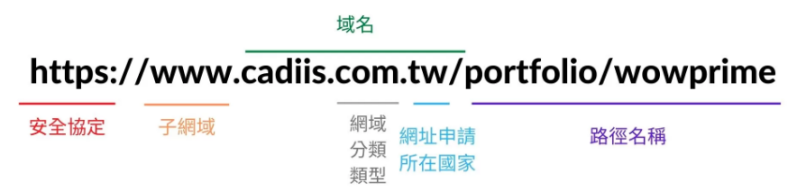

## 網域購買與憑證申請

### 網址

網址：[https://www.cloudoo.online](https://www.cloudoo.online)

 

### 在哪裡購買網域的？

GoDaddy

 

### DNS 的 A record 是什麼？

A record 中的 A 代表的是 Address，其中會 **記錄 domain name 實際對應到的 IPv4 位址**；如果是採用 IPv6 的 IP 位址，則會記錄於 AAAA record 之中。目的是要提供 DNS server 將 domain name 轉換為 IP 位址時查詢使用。

一個 Domain Name 可以設定多個 A record 對應到不同的 IP 位址，可以用來實現 load balance。

 

### DNS 的 NS record 是什麼？

NS record 中的 NS 代表的是 Name Server，其中會 **記錄負責解析該 domain name 的 name server**，在 name server 中會存有該 domain name 的 DNS record，以負責執行將 domain name 轉換為 IP 位址的工作。

一個 domain name 可以設定多個 NS record，將 DNS record 存在多個 name server 中，可以提高可靠性，確保一個 name service 無法正常工作時，仍能使用其他 name service 解析 domain name。

 

### Domain Name vs FQDN vs URL 這三者分別為何？

（URL；來源：[URL 意思是什麼？一篇了解網址結構怎麼設計及使用！ - 凱士網頁設計](https://www.cadiis.com.tw/blog/what-is-url)）

-   **FQDN (fully qualified domain name) 完整網域名稱**：server 的完整位址資訊，由左至右為 hostname + domain name。

    -   **Domain Name 網域名稱**：由右至左可以依序拆解成 「root domain → top-level domain 頂級網域 → 主網域 domain → subdomain 子網域」的層級關係，不同層級的 domain 共同構成 domain tree。

        -   top-level domain (TLD) 的類型：

            1. 通用頂級域名，Ex. .com, .net, .org, .edu, .gov, …
            2. 國家頂級域名，Ex. .tw, .us, …
            3. 新通用頂級域名，Ex. .shop, .store, .site, …

                可以依網站對應的功能選擇，使 domain name 更貼合網站內容本身。

    -   Hostname 主機名稱 — 指向特定的 server。

-   **URL (Uniform Resource Locator) 網址** — protocol 通訊協定 + FQDN + path 文件路徑 + 參數。

 

### 為什麼應該要為網站加上憑證？而不是直接用 http 就好？

https = http + secure

其中 secure 的來源是透過 SSL/TLS 憑證與使用 SSL (Secure Sockets Layer) / TLS (Transport Layer Security) 的通訊協定（目前 TLS 已取代 SSL），藉由以下功能達到確保網路連線雙方可以進行安全資料交換的效果。

1. 在 SSL/TLS handshaking 過程中，瀏覽器會透過 server 傳給 client 的 SSL/TLS 憑證 **對 server 做身分驗證**，確認 server 是對的 server。

2. 原本 http 是直接用明文傳輸，如果有人從中間截取，就可以獲得完整的資料；SSL/TLS 的通訊協定則會 **對傳輸資料加密**，可以避免傳輸資料的內容外流。

    加密的機制包含 2 種方式的搭配：

    - 非對稱式加密 — 更強調安全性

        在 SSL/TLS handshaking 過程中，server 會將自己擁有的一對 public key 和 private key 中的 public key 發送給 client，自己則保留相對的 private key。

        實際資料傳輸開始時，client 會針對單次傳輸生成 session key，並以 public key 將其加密後傳給 server，server 則使用 private key 將其解密後，也擁有該 session key。

    - 對稱式加密 — 更強調傳輸效率

        實際資料傳輸過程中，client 和 server 都會使用該 session key 來對傳輸資料做加密、解密，直到該次傳輸結束後該 session key 即失效，若有下一次的傳輸會在建生成新的 session key。

 

### 參考資料

**DNS record**

-   [DNS 記錄 | Cloudflare](https://www.cloudflare.com/zh-tw/learning/dns/dns-records/)

**Domain Name**

-   [什麼是網域名稱？如何購買網域名稱？全球最大網域註冊商 Godaddy 註冊網域教學｜網頁設計知識 - YouTube](https://www.youtube.com/watch?v=Iji7zHUUUmE)
-   [Deconstructing a Fully Qualified Domain Name (FQDN) - YouTube](https://www.youtube.com/watch?v=WCryvJByxlE)
-   [URL 意思是什麼？一篇了解網址結構怎麼設計及使用！ - 凱士網頁設計](https://www.cadiis.com.tw/blog/what-is-url)

**SSL 憑證**

-   [SSL vs TLS - Difference Between Communication Protocols - AWS](https://aws.amazon.com/compare/the-difference-between-ssl-and-tls/?nc1=h_ls)
-   [SSL, TLS, HTTPS Explained - YouTube](https://www.youtube.com/watch?v=j9QmMEWmcfo)
