# Troubleshooting Lab 驗屍報告

-   [基本資訊](#基本資訊)
-   [修復過程](#修復過程)
    -   [問題一：Nginx 未啟動](#問題一nginx-未啟動)
    -   [問題二：Disk 容量不足](#問題二disk-滿了)
    -   [問題三：Nginx 設定檔設置錯誤](#問題三nginx-設定檔設置錯誤)
    -   [問題四：port 80 被其他程式占用](#問題四port-80-被其他程式占用)
    -   [問題五：防火牆的 input 規則沒有開放對 port 80 的連線](#問題五防火牆的-input-規則沒有開放對-port-80-的連線)
    -   [問題六：沒有訪問權限](#問題六沒有訪問權限)
-   [Linux 指令筆記](#linux-指令筆記)
-   [心得](#心得)
-   [參考資料](#參考資料)

## 基本資訊

**修復對象：** AWS EC2

-   region: Tokyo (ap-northeast-1)
-   AMI: ami-0ad59b3d0f0e9076f

**修復前問題：** localhost 上呈現的內容不符合預期。

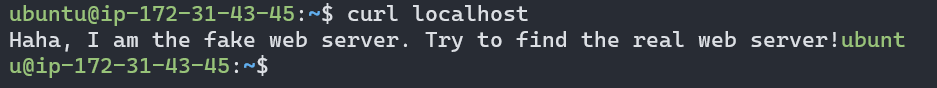

**修復後預期結果：**

```bash
$ curl localhost
<!DOCTYPE html>
<html>
  <head>
    <meta charset="utf-8">
    <title>Troubleshooting 101</title>
  </head>
  <body>
    <h1>Congratulations!</h1>
  </body>
</html>
```

## 修復過程

### 問題一：Nginx 未啟動

目標：啟動 Nginx。

1.  指令：`sudo systemctl status nginx`

    先檢查網頁部署的 **Nginx web server 的 log** 有沒有紀錄什麼資訊。

    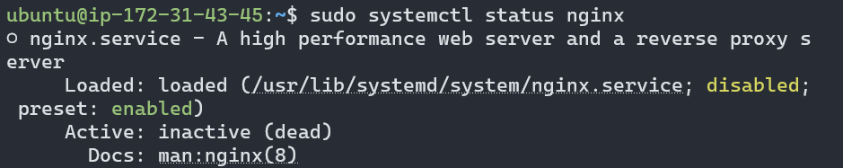

    從 **Active: inactive (dead)** 可以發現 Nginx 並沒有被啟動。

2.  指令：`sudo systemctl restart nginx`

    啟動 Nginx。

    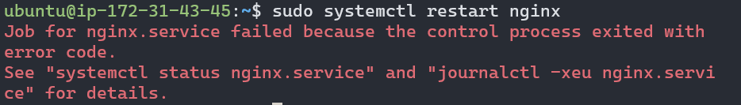

    從錯誤訊息中可以看見 Nginx 啟動失敗了。

3.  指令：`sudo systemctl status nginx`

    到 **Nginx 的 log** 看看有沒有紀錄為什麼啟動失敗的資訊。

    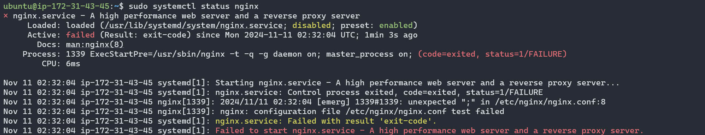

    從第 3 行及第 4 行 log 的

    ```bash
    [emerg] 1339#1339: unexpected ";" in /etc/nginx/nginx.conf:8
    nginx: configuration file /etc/nginx/nginx.conf test failed
    ```

    可以發現 **Nginx 的設定檔 /etc/nginx/nginx.conf 設置錯誤** ，在第 8 行中多了非預期的 ";"，導致沒有通過設定檔的測試，因而讓 Nginx 啟動失敗。

4.  指令：`sudo vim /etc/nginx/nginx.conf`

    開啟 /etc/nginx/nginx.conf 後，將第 8 行結尾多餘的 ";" 刪除後存檔。

    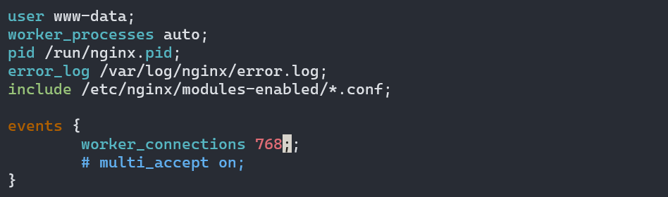

    結果在存檔的時候跳出了錯誤訊息，顯示 **Write error (file system full?)** ，似乎是 Disk 滿了導致無法存檔。

    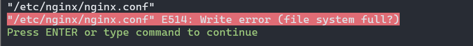

    先不存檔退出 Nginx 設定檔後，處理 Disk 容量不足的問題。

### 問題二：Disk 容量不足

目標：找出造成 Disk 容量不足的原因，判斷是否將其移出或刪除。

1.  指令：`df -h`

    透過 `df` **檢視各 Disk 的使用狀況** 以及掛載位置 。

    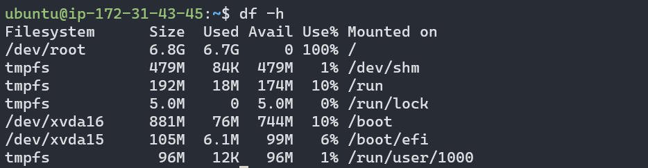

    從執行結果的第 2 行

    ```bash
    /dev/root    6.8G    6.7G    0   100%    /
    ```

    可以發現到 **掛載於 `/` 的 `/dev/root` 使用量已經達到 100% 了** ，因此才會造成剛才要寫入 /etc/nginx/nginx.conf 時沒有辦法寫入的問題。

    鎖定 `/` 再往下找有什麼可能的檔案佔據了很多容量且沒有實際功用，可以從 EC2 移出或清理掉的。

2.  指令：`sudo du --exclude=/proc -sh -BG /* | sort -r | head -n 3`

    透過 `du` 檢視 `/` 之下一層的目錄、檔案容量大小。按 GB 的容量大小排序後，先抓出容量最大的 3 個目錄。

    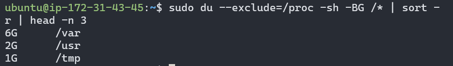

    從執行結果可以發現 `/var` 一個目錄就已經占了 6 GB 的容量，將近整個 `/` 的 6.8 GB 的容量大小，因此鎖定 `/var` 再向下搜尋。

3.  指令：`sudo du -h -d 2 -BG /var/* | sort -r | head -n 3`

    透過 `du` 檢視 `/var` 之下的目錄、檔案容量大小。同樣按 GB 的容量大小排序後，先抓出容量最大的 3 個目錄。

    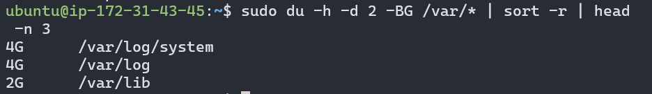

    從執行結果可以發現佔據最多容量的是 `/var/log/system` 這個目錄。

4.  指令：`ls -lh /var/log/system/`

    透過 `ls -lh` 列出 `/var/log/system` 目錄下的全部目錄、檔案容量大小。

    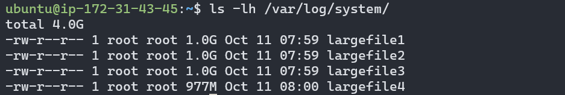

    從名稱 largefile 還有每個檔案容量都達到近 1 GB，可以推測問題大概就是來自他們了。

5.  指令：`file /var/log/system/largefile*`

    透過 `file` **檢視 largefile 的檔案類型** 。

    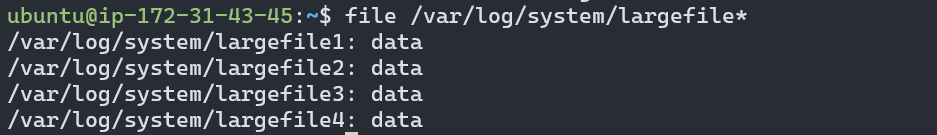

    從執行結果發現 4 個 largefile 的檔案類型都是 data，是 **無法辨識檔案類型的二進位檔案** 。

6.  指令：`hexdump -C /var/log/system/largefile*`

    利用 `hexdump` 將 largefile 的二進位檔案以十六進位輸出， **檢視 largefile 是否含有有意義的文字內容** 。

    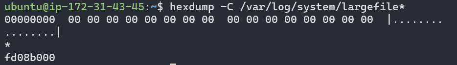

    從對 4 個檔案的內容解析發現 4 個檔案的內容全部都是 0，並不包含任何資訊，因此就可以果斷的把他們都刪掉了。

7.  指令：`sudo rm -r /var/log/system/largefile*`

    刪除所有 largefile。

    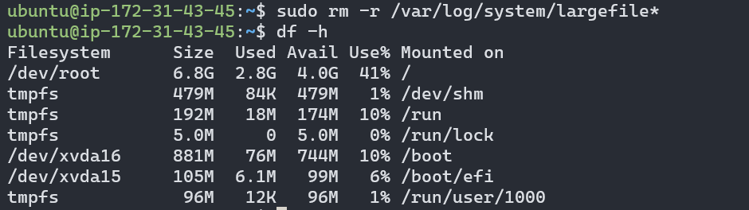

    再透過 `df` 檢視各 Disk 的使用狀況，可以發現 `/` 已經從原本的 100% 使用量下降到 41% 了，釋放出了大量空間，解決了 Disk 容量不足的問題。

    回到問題一原本 Nginx 設定檔的修改上。

### 問題三：Nginx 設定檔設置錯誤（接續問題一）

目標：修改 Nginx 設定檔。

1.  指令：`sudo vim /etc/nginx/nginx.conf`

    開啟 /etc/nginx/nginx.conf 後，將第 8 行結尾多餘的 ";" 刪除後存檔。

    

2.  指令：`sudo systemctl restart nginx`

    重新啟動 Nginx。

    

    從錯誤訊息中可以看見 Nginx 啟動還是失敗了。

3.  指令：`sudo systemctl status nginx`

    到 **Nginx 的 log** 看看有沒有紀錄為什麼啟動失敗的資訊。

    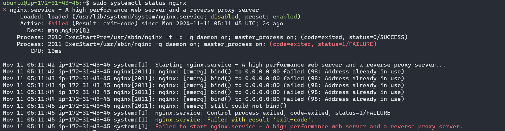

    從第 2 行到第 7 行 log 的

    ```bash
    nginx: [emerg] bind() to 0.0.0.0:80 failed (98: Address already in use)
    nginx: [emerg] still could not bind()
    ```

    可以發現 Nginx 要 bind 在 port 80 啟動時，**port 80 已經被其他程式占用** ，導致 Nginx 沒有辦法在該 port 啟動。

### 問題四：port 80 被其他程式占用

目標：確定 port 80 目前執行的程式是什麼，判斷是要停用該程式，還是將 Nginx 移至其他 port 執行。

1.  指令：`sudo ss -tulnp | head -n 1 && sudo ss -tulnp | grep :80`

    透過 `ss` **檢查 port 80 被哪個程式占用** 。

    

    從執行結果可以發現目前是 pid = 576，名稱為 srv 的程式在使用 port 80。

2.  指令：`sudo systemctl status srv`

    因為 **srv 在一開機就已經自動啟動了，推測他有可能是由 `systemd` 管理的服務** ，所以透過 `systemctl` 來檢視是否有 srv 的資訊。

    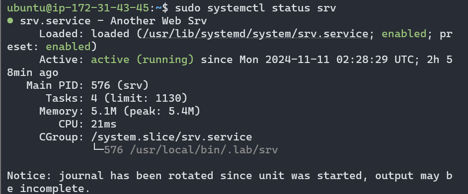

    從執行結果可以發現 srv 確實是經由 `systemd` 管理並且可以在每次開機自動啟動的服務。但他的 log 資訊並沒有呈現在 `systemctl status` 中。

3.  指令：`sudo journalctl -u srv --no-pager`

    透過 `journalctl` **檢視 srv 完整的 log 紀錄**。

    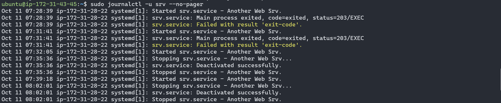

    從完整的 log 紀錄只有看到 start、stop、fail 等事件，沒有關於執行動作的 log，而且幾乎都是一啟動就會被停掉，或是一啟動就出狀況。

4.  指令：`top -p 576`

    透過 `top` **檢視 srv 目前執行狀況** 。

    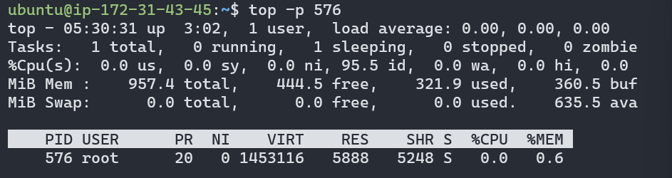

    從執行結果來看也與 log 中的結果相符，目前都是被暫停的狀況，也沒有使用到什麼資源，看起來沒有在執行工作，應該可以被關掉。

5.  指令：`sudo systemctl disable srv`

    為了避免以後主機 reboot 後 `systemd` 又自動啟動 srv，所以 **把 srv 設定成 disabled** 。

    

6.  指令：`sudo systemctl stop srv`

    停用 srv 服務。

7.  指令：`sudo systemctl enable nginx`

    因為我們的網頁是部署在 Nginx，可以 **把 Nginx 設定成 enabled，讓 `systemd` 在主機 reboot 之後可以自動啟動 Nginx**。

    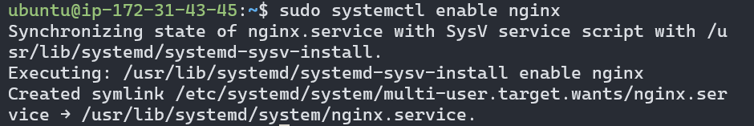

8.  指令：`sudo systemctl restart nginx`

    重新啟動 Nginx，這次就不會再出現錯誤訊息了。

9.  指令：`sudo systemctl status nginx`

    到 Nginx 的 log 檢視執行狀況。

    

    從執行結果可以看到這次 Nginx 的啟動已經沒有再出問題。

10. 指令：`curl localhost`

    連到 localhost 看看目前的修復進度。

    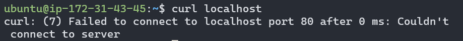

    從執行結果的錯誤訊息可以發現沒有辦法連線到 server，可能的原因包含：

    1. server 沒有啟動。

        透過前述第 8 ~ 9 步驟，已經確定 Nginx 有成功啟動，因此可以排除 server 沒有啟動的可能性。

    2. server 沒有在 port 80 執行。

        透過問題四中前面的所有步驟，應該已經確定 Nginx 有在 port 80 執行了。透過 `ss` 再檢查一次，也可以驗證，因此可以排除 server 沒有在 port 80 執行的可能性。

        

    3. 防火牆的 input 規則沒有開放對 port 80 的連線。

    所以剩下最後一個可能性就是 **防火牆的 input 規則沒有開放**。

### 問題五：防火牆的 input 規則沒有開放對 port 80 的連線

目標：防火牆的 input 規則設定成開放對 port 80 的連線。

1.  指令：`sudo iptables -L`

    透過 `iptables` **檢視防火牆的規則設定**。

    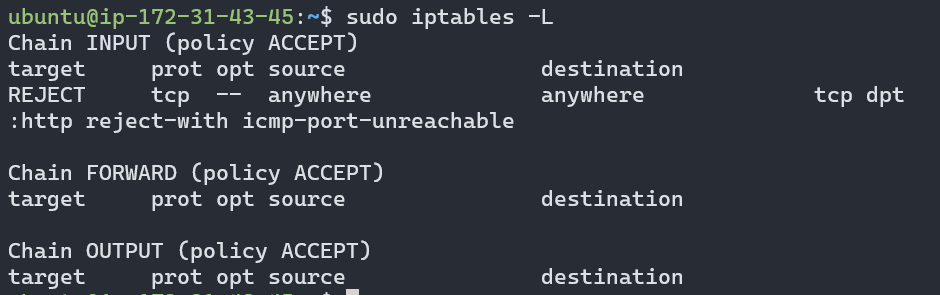

    從執行結果

    ```bash
    Chain INPUT (policy ACCEPT)
    target  prot    opt     source      destination
    REJECT  tcp     --      anywhere    tcp     anywhere    dpt:http reject-with icmp-port-unreachable
    ```

    可以看到 **http 連線（預設為 port 80）被設定成 reject 了** ，所以剛才執行 `curl localhost` 才會有無法連線到 server 的問題。

2.  指令：`sudo iptables -D INPUT 1`

    從 (policy ACCEPT) 可以知道預設的規則為 accept，所以只需要把額外設定的對 http 連線的 reject 規則刪掉即可。

    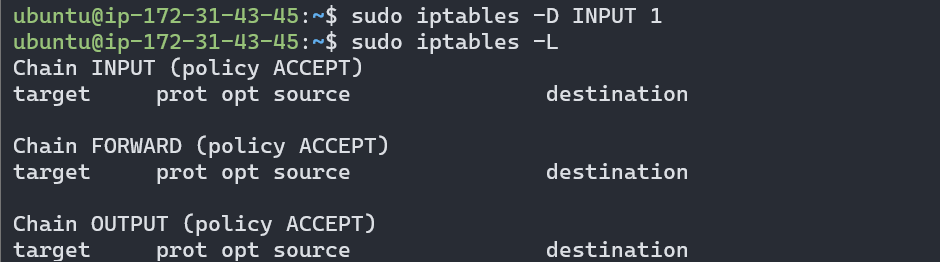

3.  指令：`cat /etc/iptables/rules.v4`

    防火牆的規則可以存在 `/etc/iptables/rules.v4` 檔案中，這樣當主機 reboot 的時候，系統就會自動依據該檔案內容，將已儲存的規則建立起來，不需要自行手動設定。

    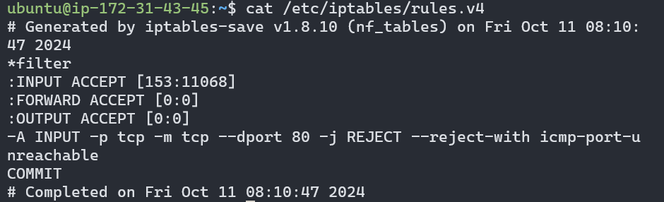

    從執行結果可以看到對於 http 連線的 reject 規則也確實是被寫在這個檔案裡了，所以才會在一建立起主機的時候就遇到這個防火牆規則的限制。

4.  指令：

    ```bash
    $ sudo -i
    $ iptables-save > /etc/iptables/rules.v4
    $ exit
    ```

    **透過 `iptables-save` 可以把目前設定好的防火牆規則寫入到 `/etc/iptables/rules.v4`**，以確保未來主機 reboot 的時候都可以自動套用目前的規則。

    另外因為 `/etc/iptables/rules.v4` 只有 root 使用者有寫的權限，因此可以透過 `sudo -i` 切換至 root 使用者模式執行寫入，執行完畢後再執行 `exit` 退回原本一般使用者模式。

    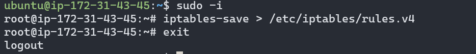

5.  指令：`cat /etc/iptables/rules.v4`

    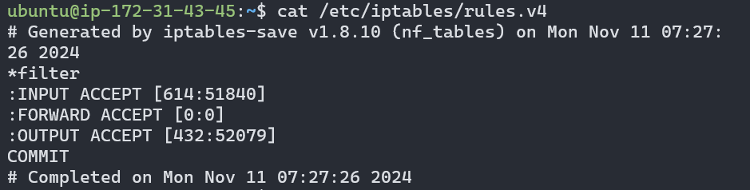

    執行完 `iptables-save` 後就可以看到 `/etc/iptables/rules.v4` 已經被更新成新的規則了。

6.  指令：`curl localhost`

    連到 localhost 看看目前的修復進度。

    

    從執行結果已經可以看到網頁呈現了，但出現了 403 Forbidden 沒有訪問權限的代碼。

### 問題六：沒有訪問權限

目標：開啟其他使用者對於 server 所執行的檔案與其目錄的權限，目錄至少要有 r、x 的權限、檔案至少要有 r 的權限。

1.  指令：`vim /etc/nginx/nginx.conf`

    首先要找出 server 所執行的檔案與其目錄時來自於哪裡的。

    

    從 `/etc/nginx/nginx.conf` 中並沒有看到對 server 的設定，但在 http 群組中有 include `/etc/nginx/sites-enabled/*` 的其他設定檔。

2.  指令：`ls /etc/nginx/sites-available/`

    

    在 `/etc/nginx/sites-enabled` 下只有 default 這個檔案。

3.  指令：`vim /etc/nginx/sites-available/default`

    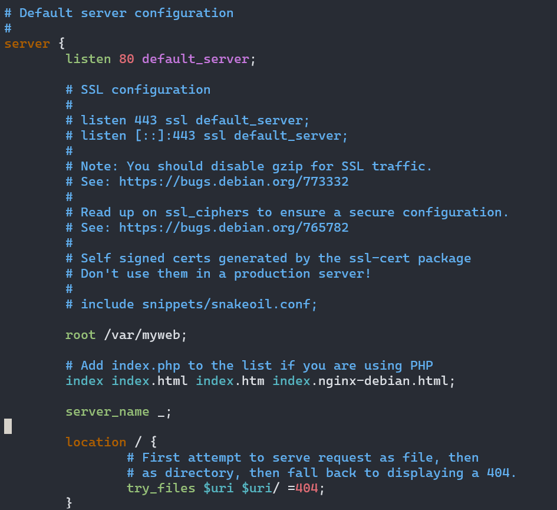

    在 `/etc/nginx/sites-enabled/default` 下就可以看到預設的 server 設定了，其中可以得知 **伺服器執行的根目錄是 `/var/myweb`**。

4.  指令：`ls -lh /var | grep myweb`

    首先先檢查根目錄 `/var/myweb` 的權限，是否 **至少有 x (execute) 的權限，可以開啟進入該目錄中，以及 r (read) 的權限，可以查看該目錄中有哪些內容**。

    

    從執行結果可以看到其他使用者對 `/var/myweb` 的權限是 r-x，原本就已經有開放 r (read) 和 x (execute)，符合權限要求。

5.  指令：`ls -lh /var/myweb/`

    再來檢查根目錄底下檔案的權限，是否 **至少有 r (read) 的權限，才可以讀取檔案內容**。

    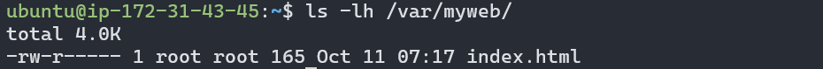

    從執行結果可以看到其他使用者對於 `index.html` 檔案的權限是 ---，完全沒有開放權限，不符合要求。

6.  指令：`sudo chmod 644 /var/myweb/index.html`

    將其他使用者對於 `/var/myweb/index.html` 的權限調整為 4，也就是 r-- 有 r (read) 權限，讓 server 可以讀取該檔案。

    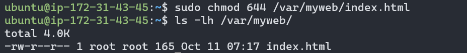

7.  指令：`curl localhost`

    再連到 localhost 就可以看到預期應該呈現的內容了。

    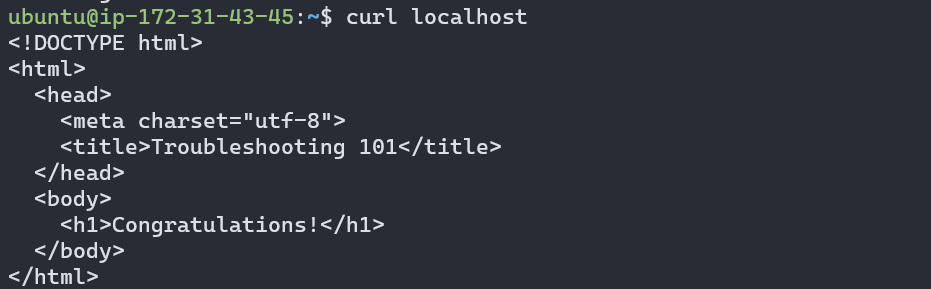

## Linux 指令筆記

## 心得

## 參考資料
